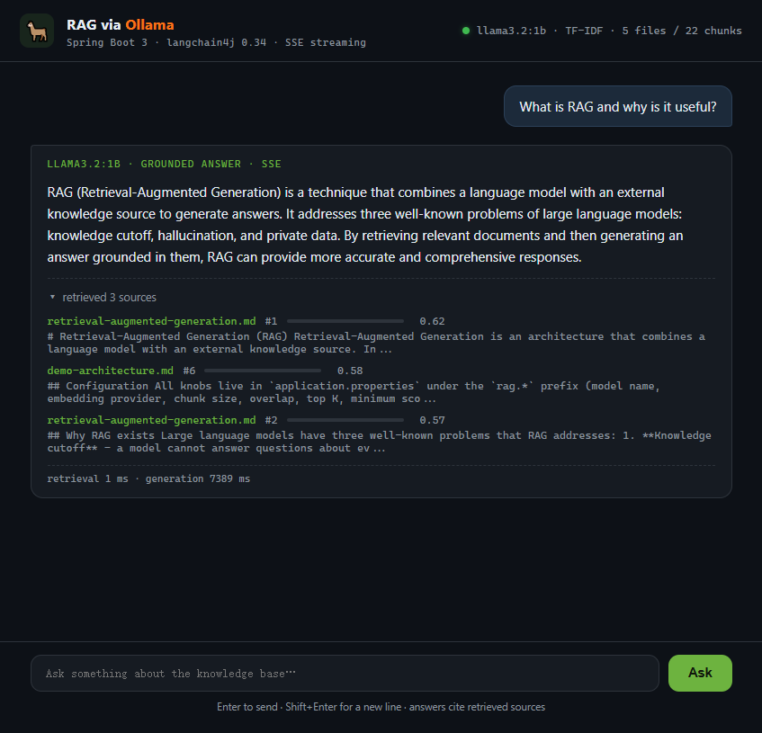
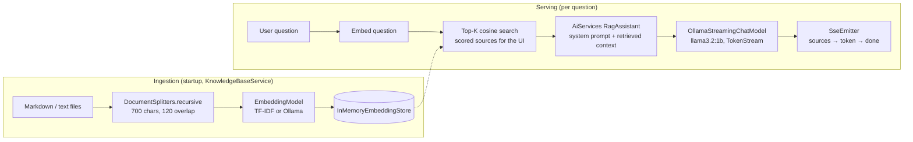

# RAG via Ollama 🦙

**A self-contained Retrieval-Augmented Generation demo running 100% locally — Spring Boot 3, langchain4j 0.34, SSE streaming, one fat JAR.**

Questions are answered by `llama3.2:1b` through a local [Ollama](https://ollama.com) server, grounded
in a small bundled knowledge base. No API keys, no cloud services, no data leaving the machine.




---

## Why this project exists

A compact, production-shaped reference for the **full RAG pipeline on Spring Boot + langchain4j**:
typed configuration, conditional bean wiring, a custom `EmbeddingModel`, an `AiServices`-built
streaming assistant with application-owned retrieval, and token-by-token streaming pushed to the
browser over Server-Sent Events. Every component is small enough to read in one sitting and
swappable enough to grow into a production service.

| What is demonstrated | Where |
|---|---|
| Spring Boot 3 + `@ConfigurationProperties` (record binding) | [`RagProperties`](src/main/java/com/ai/rag/config/RagProperties.java) |
| langchain4j bean wiring (`AiServices`, `EmbeddingStore`) | [`LangChain4jConfig`](src/main/java/com/ai/rag/config/LangChain4jConfig.java) |
| Custom `EmbeddingModel` (TF-IDF) plugged into langchain4j | [`TfIdfEmbeddingModel`](src/main/java/com/ai/rag/embedding/TfIdfEmbeddingModel.java) |
| Streaming assistant interface (`TokenStream`) | [`RagAssistant`](src/main/java/com/ai/rag/service/RagAssistant.java) |
| Startup ingestion: split → fit → embed → store | [`KnowledgeBaseService`](src/main/java/com/ai/rag/service/KnowledgeBaseService.java) |
| SSE orchestration (`SseEmitter` + `TokenStream` callbacks) | [`RagService`](src/main/java/com/ai/rag/service/RagService.java) |
| REST API (`/api/health`, `/api/retrieve`, `/api/chat/stream`) | [`ChatController`](src/main/java/com/ai/rag/web/ChatController.java) |
| EventSource chat UI, no build step | [`index.html`](src/main/resources/static/index.html) |

## Architecture



The assistant is assembled with langchain4j `AiServices`: it wires the streaming chat model and
the grounding system prompt into one interface. Retrieval is deliberately owned by the
application, not by a `RetrievalAugmentor`: `RagService` applies the score thresholds itself and
injects the surviving chunks as the `{{context}}` variable of the assistant's `@UserMessage`
template — so the source cards in the UI are exactly the chunks the model is grounded on.

## SSE event protocol

`GET /api/chat/stream?question=...` answers with `text/event-stream`:

| Event | Data (JSON) | Meaning |
|---|---|---|
| `sources` | `[{file, chunk, score, snippet}, ...]` | Retrieved chunks, sent before the first token |
| `token` | `{"text": "..."}` | One streamed generation token |
| `done` | `{"retrievalMs": 9, "generationMs": 8591}` | Stream finished, with timings |
| `error` | `{"message": "..."}` | Something failed; the stream ends |

The browser consumes this with a plain `EventSource` — no WebSocket, no client library.

## Quick start

**Prerequisites:** Java 17+, Maven 3.8+, and [Ollama](https://ollama.com/download) with the model pulled:

```bash
ollama pull llama3.2:1b
```

**Build & run:**

```bash
mvn -q package
java -jar target/rag-via-ollama.jar
```

Open <http://localhost:8080>, click a suggestion chip and watch tokens stream in.

Try it from the terminal — a real, unedited session:

```console
$ curl -N "http://localhost:8080/api/chat/stream?question=What+is+RAG+and+why+is+it+useful%3F"

event: sources
data: [{"file":"retrieval-augmented-generation.md","chunk":1,"score":0.616,...}]

event: token
data: {"text":"RAG"}

event: token
data: {"text":" ("}

... (tokens keep streaming)

event: token
data: {"text":"RAG (Retrieval-Augmented Generation) is a technique that combines a language model with an external knowledge source... "}

event: done
data: {"retrievalMs":9,"generationMs":8591}
```

## Configuration

Everything lives in [`application.properties`](src/main/resources/application.properties) and can be
overridden by environment variables (`rag.ollama.model` → `RAG_OLLAMA_MODEL`) or command-line flags
(`--rag.retrieval.top-k=5`).

| Key | Default | Meaning |
|---|---|---|
| `rag.ollama.base-url` | `http://localhost:11434` | Ollama server base URL |
| `rag.ollama.model` | `llama3.2:1b` | Generation model |
| `rag.ollama.embedding-model` | `nomic-embed-text` | Embedding model used when provider = `ollama` |
| `rag.ollama.timeout` | `60s` | Ollama request timeout |
| `rag.embedding.provider` | `tfidf` | `tfidf` (built-in, zero downloads) or `ollama` (semantic) |
| `rag.docs.path` | *(empty)* | External knowledge-base folder; empty = bundled corpus |
| `rag.chunking.size` | `700` | Maximum chunk length |
| `rag.chunking.overlap` | `120` | Overlap carried into the next chunk |
| `rag.retrieval.top-k` | `3` | Chunks injected into the prompt |
| `rag.retrieval.min-score` | `0.05` | Absolute relevance floor (see note below) |
| `rag.retrieval.relative-margin` | `0.05` | Drop chunks scoring this much below the best hit |
| `rag.generation.temperature` | `0.2` | Sampling temperature |
| `rag.generation.num-predict` | `512` | Answer token budget |
| `server.port` | `8080` | Web UI port |

**About embeddings:** the default TF-IDF provider is a hand-written langchain4j `EmbeddingModel`
(needs no extra model, so a single `ollama pull llama3.2:1b` is enough to run the demo). For
semantic (paraphrase-aware) retrieval, start Ollama with embeddings enabled
(`ollama serve --embeddings`), pull an embedding model (`ollama pull nomic-embed-text`) and set
`--rag.embedding.provider=ollama` — the bean wiring in `LangChain4jConfig` swaps the model via
`@ConditionalOnProperty`, nothing else changes.

**About retrieval scores:** the score is langchain4j's relevance score, `(cosine + 1) / 2`, and
its scale depends on the encoder. nomic-embed-text clusters all sentences in a narrow cone — even
unrelated text scores ~0.7 — so absolute thresholds must be tuned per provider (measured on the
bundled corpus: unrelated questions 0.71-0.77 vs on-topic 0.775-0.85 with nomic-embed-text, hence
`0.77`; unrelated text scores near 0 with TF-IDF, hence `0.05`). The relative margin handles the
rest model-independently: chunks scoring more than `relative-margin` below the best hit are cut,
and when *everything* is weak (below `min-score`) no sources are shown at all and the model says
so.

## Web API

| Method | Endpoint | Body / Response |
|---|---|---|
| `GET` | `/api/health` | → server, model, corpus and embedding status |
| `POST` | `/api/retrieve` | `{"question": "..."}` → retrieved sources with scores & snippets |
| `GET` | `/api/chat/stream?question=...` | → SSE stream: `sources` → `token`… → `done` |

Retrieval and generation are separate endpoints on purpose: each RAG stage can be tested
independently (e.g. with `curl`) and the UI renders sources before the first token arrives.

## Project structure

```
src/main/java/com/ai/rag/
├── RagDemoApplication.java        # @SpringBootApplication entry point
├── config/
│   ├── RagProperties.java         # rag.* configuration (record binding)
│   └── LangChain4jConfig.java     # models, store, retriever, RagAssistant beans
├── embedding/
│   └── TfIdfEmbeddingModel.java   # custom langchain4j EmbeddingModel (lexical TF-IDF)
├── service/
│   ├── RagAssistant.java          # AiServices interface → TokenStream chat()
│   ├── KnowledgeBaseService.java  # startup ingestion + Ollama health checks
│   └── RagService.java            # SSE orchestration, scored retrieval, timings
└── web/ChatController.java        # REST endpoints incl. SSE chat stream

src/main/resources/
├── application.properties         # all configuration knobs
├── docs/                          # the demo knowledge base (5 markdown files)
└── static/index.html              # single-page SSE chat UI (no build step)
```

## The bundled knowledge base

The demo ships with five short markdown documents about RAG itself — retrieval-augmented
generation, Ollama and llama3.2, embeddings & similarity, chunking strategies, and this
demo's own architecture — so the corpus explains the project. Point `rag.docs.path` at any
folder of `.md`/`.txt` files to answer questions over your own text.

## Production upgrade paths

| Demo choice | Production alternative |
|---|---|
| `InMemoryEmbeddingStore` | Qdrant / pgvector / Milvus via the same langchain4j `EmbeddingStore` SPI |
| TF-IDF / `nomic-embed-text` | Domain-tuned or hybrid (BM25 + dense) retrieval, reranking |
| `llama3.2:1b` | Any Ollama model, or a cloud LLM behind the same `RagAssistant` |
| `SseEmitter` per request | Virtual threads, backpressure, resumable streams (SSE keep-alive) |
| Startup ingestion | Incremental ingestion, persistence, per-tenant collections |
| `@ConfigurationProperties` profiles | Spring profiles per environment, config server |

## License

[MIT](LICENSE)
