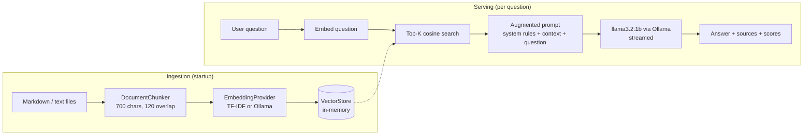

# RAG via Ollama 🦙

**A self-contained Retrieval-Augmented Generation demo running 100% locally — Java 17, zero ML frameworks, one fat JAR.**

Questions are answered by `llama3.2:1b` through a local [Ollama](https://ollama.com) server, grounded
in a small bundled knowledge base. No API keys, no cloud services, no data leaving the machine.


---

## Why this project exists

A compact, readable reference for the **full RAG pipeline in plain Java**: document loading,
chunking, embeddings, vector search, prompt augmentation and streamed generation — with no
framework magic hiding the moving parts. Every component is small enough to read in one
sitting and swappable enough to grow into a production service.

| What is demonstrated | Where |
|---|---|
| Streaming chat with a local LLM (NDJSON) | [`OllamaClient`](src/main/java/com/ai/rag/ollama/OllamaClient.java) |
| Pluggable embedding layer (TF-IDF ⟷ Ollama) | [`embedding/`](src/main/java/com/ai/rag/embedding) |
| Paragraph/sentence-aware chunking with overlap | [`DocumentChunker`](src/main/java/com/ai/rag/rag/DocumentChunker.java) |
| Cosine-similarity vector search (top-K) | [`VectorStore`](src/main/java/com/ai/rag/rag/VectorStore.java) |
| Grounded prompt engineering + citations | [`RagPipeline`](src/main/java/com/ai/rag/rag/RagPipeline.java) |
| REST API + chat UI on the JDK HTTP server | [`WebServer`](src/main/java/com/ai/rag/web/WebServer.java), [`index.html`](src/main/resources/web/index.html) |

## Architecture



## Quick start

**Prerequisites:** Java 17+, Maven 3.8+, and [Ollama](https://ollama.com/download) with the model pulled:

```bash
ollama pull llama3.2:1b
```

**Build & run:**

```bash
mvn -q package
java -jar target/rag-via-ollama.jar --web
```

Open <http://localhost:8080> and ask away. The CLI works too:

```bash
# interactive chat
java -jar target/rag-via-ollama.jar

# one-shot question
java -jar target/rag-via-ollama.jar --ask "What is RAG and why is it useful?"

# quiz your own knowledge base (any folder of .md/.txt files)
java -jar target/rag-via-ollama.jar --web --docs ./my-notes
```

Example CLI session (real output, unedited):

```
$ java -jar target/rag-via-ollama.jar --ask "What is RAG and why is it useful?"

[kb]   ingested 5 files -> 23 chunks  (TF-IDF (built-in, 551 terms, 23 fitted chunks), 53 ms)
RAG stands for Retrieval-Augmented Generation, an architecture that combines a language
model with an external knowledge source. It retrieves relevant documents and then generates
an answer grounded in them. This approach addresses three well-known problems in large
language models: knowledge cutoff, hallucination, and private data. ...
sources:
  - retrieval-augmented-generation.md  chunk 19  score 0.258
  - retrieval-augmented-generation.md  chunk 20  score 0.172
  - retrieval-augmented-generation.md  chunk 21  score 0.131
timing: retrieval 17 ms, generation 9946 ms
```

## Configuration

Everything lives in [`app.properties`](src/main/resources/app.properties) and can be overridden
by environment variables (`ollama.model` → `OLLAMA_MODEL`, `chunk.size.chars` → `CHUNK_SIZE_CHARS`, ...).

| Key | Default | Meaning |
|---|---|---|
| `ollama.url` | `http://localhost:11434` | Ollama server base URL |
| `ollama.model` | `llama3.2:1b` | Generation model |
| `embedding.provider` | `tfidf` | `tfidf` (built-in, zero downloads) or `ollama` (semantic) |
| `embedding.model` | `nomic-embed-text` | Embedding model used when provider = `ollama` |
| `chunk.size.chars` | `700` | Maximum chunk length |
| `chunk.overlap.chars` | `120` | Overlap carried into the next chunk |
| `retrieval.topk` | `3` | Chunks injected into the prompt |
| `retrieval.min.score` | `0.05` | Cosine similarity floor |
| `generation.temperature` | `0.2` | Sampling temperature |
| `generation.num.predict` | `512` | Answer token budget |
| `web.port` | `8080` | Web UI port |

**About embeddings:** the default TF-IDF provider needs no extra model, which keeps the demo
runnable with a single `ollama pull llama3.2:1b`. For semantic (paraphrase-aware) retrieval,
start Ollama with embeddings enabled (`ollama serve --embeddings`), pull an embedding model
(`ollama pull nomic-embed-text`) and set `EMBEDDING_PROVIDER=ollama`.

## Web API

| Method | Endpoint | Body / Response |
|---|---|---|
| `GET` | `/api/health` | → server, model, corpus and embedding status |
| `POST` | `/api/retrieve` | `{"question": "..."}` → retrieved sources with scores & snippets |
| `POST` | `/api/answer` | `{"question": "..."}` → answer streamed as plain-text chunks |

Retrieval and generation are separate endpoints on purpose: each RAG stage can be tested
independently (e.g. with `curl`) and the UI renders sources before the first token arrives.

## Project structure

```
src/main/java/com/ai/rag/
├── App.java                      # entry point: CLI, --ask, --web modes
├── config/AppConfig.java         # app.properties + env overrides
├── ollama/OllamaClient.java      # Ollama REST: tags / chat (stream) / embed
├── embedding/
│   ├── EmbeddingProvider.java    # pluggable embedding interface
│   ├── TfIdfEmbeddingProvider.java   # built-in lexical vector space (default)
│   └── OllamaEmbeddingProvider.java  # semantic embeddings via /api/embed
├── rag/
│   ├── DocumentLoader.java       # classpath / folder document loading
│   ├── DocumentChunker.java      # paragraph & sentence-aware splitting
│   ├── VectorStore.java          # in-memory store, cosine top-K
│   └── RagPipeline.java          # ingest + retrieve + augment + generate
└── web/WebServer.java            # JDK HTTP server, JSON API + streaming

src/main/resources/
├── app.properties                # all configuration knobs
├── docs/                         # the demo knowledge base (5 markdown files)
└── web/index.html                # single-page chat UI (no build step)
```

## The bundled knowledge base

The demo ships with five short markdown documents about RAG itself — retrieval-augmented
generation, Ollama and llama3.2, embeddings & similarity, chunking strategies, and this
demo's own architecture — so the corpus explains the project. Replace the folder contents
(or point `--docs` at your own) to answer questions over any text you have.

## Production upgrade paths

| Demo choice | Production alternative |
|---|---|
| In-memory `VectorStore` | Qdrant / pgvector / Milvus with ANN indexes |
| TF-IDF / `nomic-embed-text` | Domain-tuned or hybrid (BM25 + dense) retrieval, reranking |
| `llama3.2:1b` | Any Ollama model, or a cloud LLM behind the same `RagPipeline` |
| JDK `HttpServer` | Spring Boot / Quarkus wrapping the same pipeline |
| Startup ingestion | Incremental ingestion, persistence, per-tenant collections |

## License

[MIT](LICENSE)
